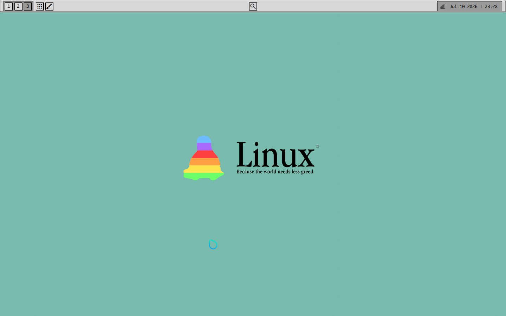

#  Linux Retroism 

▐ **Linux Retroism is a Linux-rice based on the 1980-1990's user-interface aesthetic** ▌

 

### Features (v0.1) 🛈

- Fully quickshell-based front-end (taskbar, app launcher, settings menu, etc)
- Theme support & Built-in theme switcher
- Icon theme & GTK theme

 

<strong>Window Manager:</strong> 

`Hyprland` (mandatory because this is my config and I said so :3)

 

### Download & Installation 🡇

- After you've cloned the repo, move the repo to `/etc`. Move your `hardware-configuration.nix` to the folder before renaming it to `/etc/nixos`.
- There are more steps but I don't remember them right now. Best of luck. :)

### ✦ Notes & TODO Lists

Both the Icon theme and GTK theme are very early, I may or may not update them within a reasonable timeframe if/when diinki does.

**v0.2 TODO List:**

- [ ] Update GTK Theme to be less janky.
- [ ] Higher res icon theme and more icons.
- [ ] Proper settings menu, change font sizes, font, wallpapers, etc.
- [ ] Refactor quickshell code where need be.
- [ ] Better laptop support (battery indicator)
- [ ] UI/UX Improvements

### ✦ License

This project is licensed under the permissive MIT license, which is included in the root directory
of this repository.
